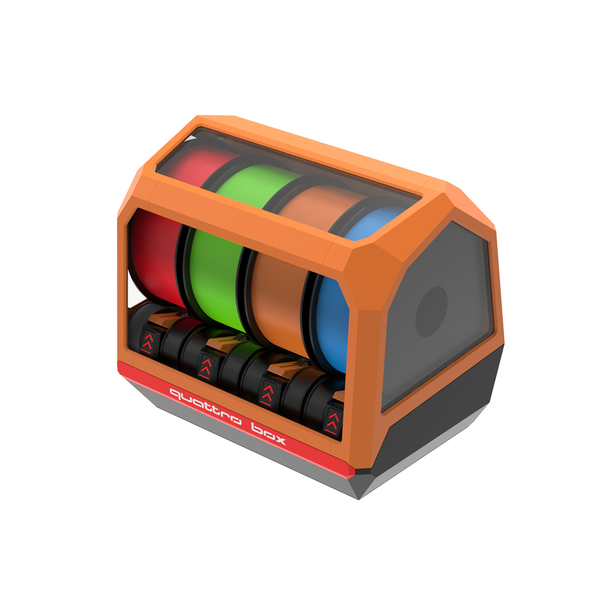

# FYSETC-QuattroBox

1. Project
   This is the project database created by FYSETC for the QuattroBox suite, making it convenient for you to search for information. Thanks to the excellent work of the QuattroBox team, they are always able to design outstanding machines.
   
   Github：https://github.com/Batalhoti/QuattroBox/tree/main

   

2. We make some small changes base on the QuattroBox official material. Like change：
   - X5 motherboard+X5 adapter board（Motherboard information：https://wiki.fysetc.com/docs/CHAMELEON-X5）；
   - Equipped with Binky encoder, it can achieve precise filament positioning；
   - Mechanical limit switch, safe and reliable；
   - NEMA 17 stepper motor；

3. Instructions
   We have updated the installation guide on WIKI,； link:([https://wiki.fysetc.com/](https://wiki.fysetc.com/docs/FYSETCQuattroBox))

4. FAQ
   - Q: How to install to my 3D printer? A: You can watch  [the assembly manual](https://github.com/FYSETC/FYSETC-QuattroBox/tree/main/Documentation).We have made some changes，Replace pages 177-186 of the original installation manual.
   - Q：Does the installation require additional printed fixtures?  A：Not needed

5. Shop
   -  [Aliexpress]().
   -  [Amazon]().

6. Tech Support

Facebook group：https://www.facebook.com/groups/197476557529090/

Tech Support Email： hunter@fysetc.com 

Forum：https://forum.fysetc.com/
